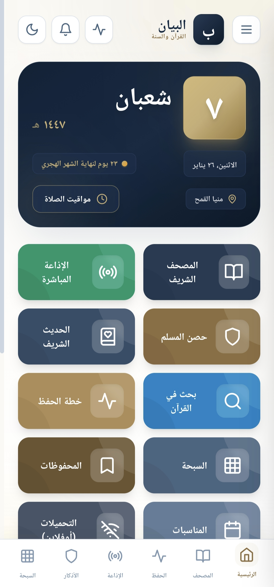
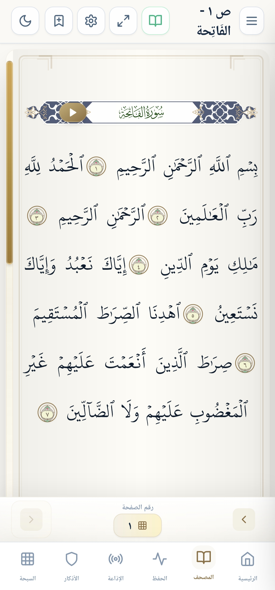
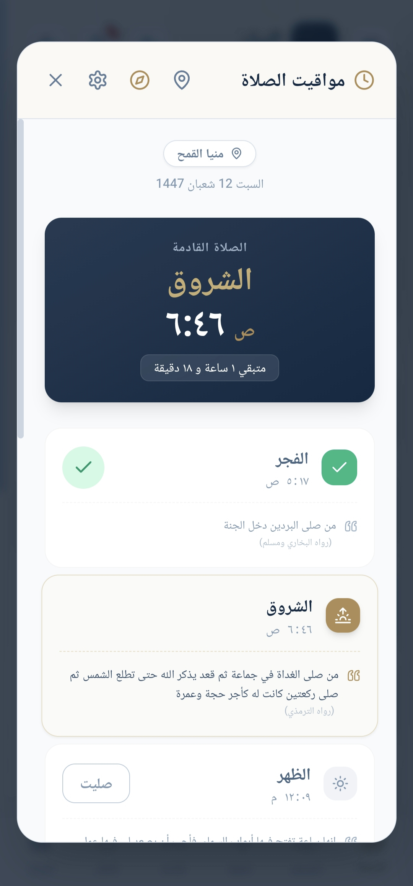
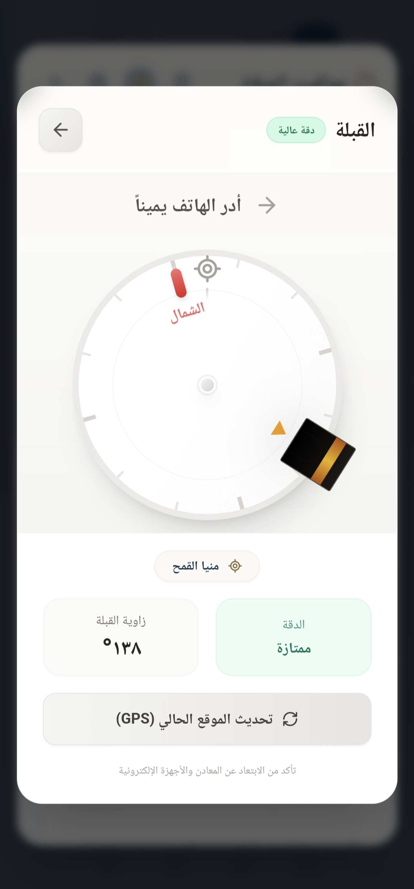
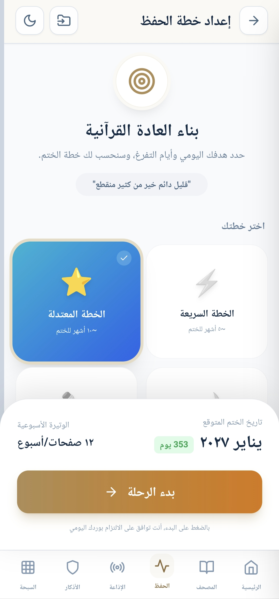
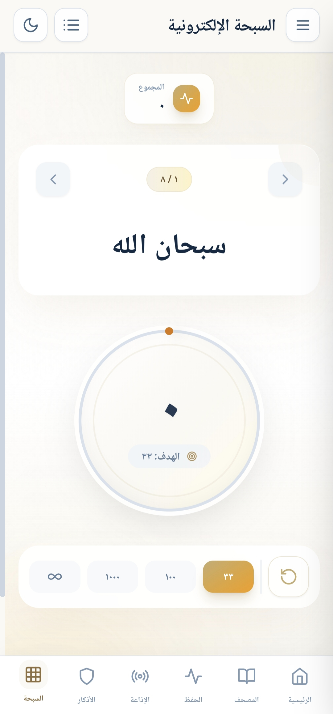
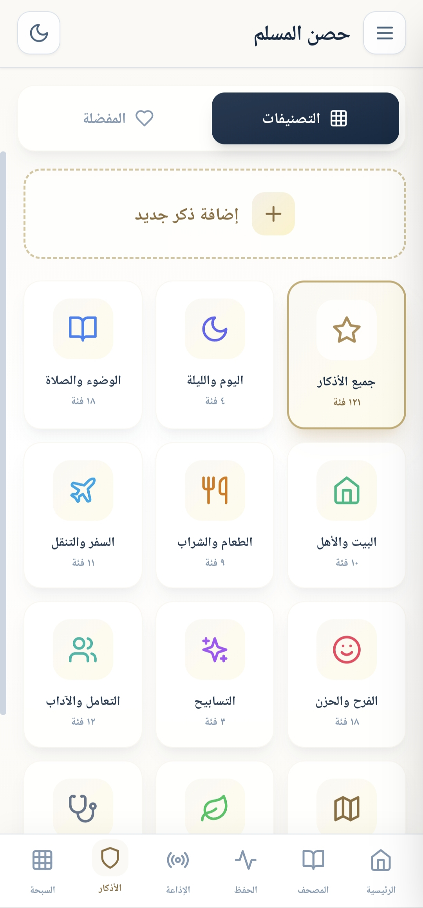
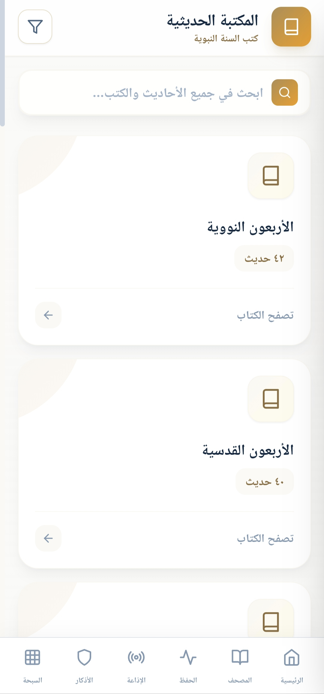
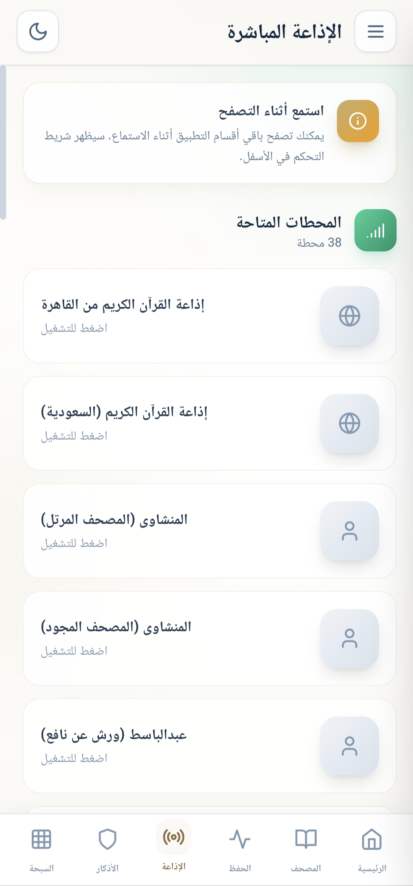
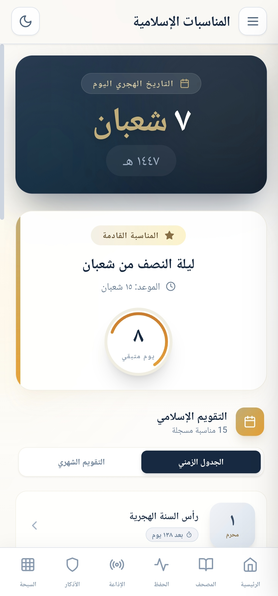

## البيان | Al-Bayan

<strong>البيان</strong> تطبيق إسلامي متكامل يجمع قراءة القرآن الكريم والتلاوات الصوتية وخطة للحفظ، مواقيت الصلاة والأذان والقبلة، الأذكار، والأحاديث — في تجربة واحدة سلسة بواجهة عربية أنيقة ودعم الوضع الليلي. يعمل دون إنترنت بعد التحميل.

<h3>✨ أهم المميزات:</h3>

<ul style="list-style-position: inside; padding-right: 16px; padding-left: 0; margin: 0;">
  <li>📖 القرآن الكريم بخط واضح، تكبير/تصغير، بحث داخل المصحف، علامات مرجعية، وتلاوة آية بآية مع تظليل تفاعلي.</li>
  <li>🎧 تلاوات متعددة (أكثر من 20 قارئًا) + تنزيل الصوت للاستماع بدون إنترنت.</li>
  <li>📚 تفاسير مختارة: ابن كثير، الجلالين، والتفسير الميسر.</li>
  <li>🧠 نظام ذكي لحفظ القرآن الكريم بخطط متعددة + تكرار متباعد (SRS) + اختبارات ذاتية + تتبع التقدم والإنجازات ومشاركة النتائج.</li>
  <li>🕌 مواقيت الصلاة والأذان عبر حساب داخلي بطرق حساب متعددة ومعتمدة لمناطق مختلفة، مع مؤذنين متنوعين، وتنبيهات قبل الصلاة.</li>
  <li>بوصلة القبلة ومؤشر دقة.</li>
  <li>📿 الأذكار والتسبيح: مكتبة أذكار + عداد تسبيح + مفضلة + إمكانية إضافة أذكار مخصصة.</li>
  <li>📕 الأحاديث النبوية: قاعدة بيانات داخلية منظمة تشمل الكتب الستة، مع بحث سريع ومتقدم.</li>
</ul>

<h3>🔔 تنبيهات ذكية قابلة للتحكم:</h3>

<ul style="list-style-position: inside; padding-right: 16px; padding-left: 0; margin: 0;">
  <li>تنبيهات الصلاة والاذان</li>
  <li>أذكار الصباح والمساء</li>
  <li>تذكير الورد اليومي للحفظ</li>
  <li>تنبيهات الصلاة على النبي ﷺ (نصية وصوتية) ويمكن التحكم بها من إعدادات الإشعارات والتنبيهات</li>
</ul>

<ul style="list-style-position: inside; padding-right: 16px; padding-left: 0; margin: 14px 0 0;">
  <li>📻 إذاعات القرآن وتدعم التشغيل في الخلفية مع تحكم من الإشعارات (تتطلب إنترنت).</li>
  <li>📅 التقويم الهجري والمناسبات + عدّ تنازلي للأيام المهمة + ويدجت التاريخ الهجري للشاشة الرئيسية.</li>
  <li>🌙 تنبيهات رمضان: تذكير السحور والإفطار وتنبيهات العشر الأواخر (مع تمييز ليالي الوتر).</li>
  <li>🕋 دليل الحج والعمرة خطوة بخطوة + أدعية مأثورة.</li>
</ul>

<h3>✅ المصادر والموثوقية</h3>

<ul style="list-style-position: inside; padding-right: 16px; padding-left: 0; margin: 0;">
  <li>تم الاعتماد علي مصادر موثوقة ومعروفة في الأقسام الأساسية (القرآن الكريم، التفاسير، الأذكار، والأحاديث).</li>
  <li>تم الاستفادة ايضا من أدوات ومكتبات مفتوحة المصدر لتحسين الاستقرار والأداء.</li>
  <li>في حال ملاحظة أي خطأ غير مقصود أو محتوى يحتاج مراجعة، نرجو إبلاغنا ليتم التدقيق والتصحيح في أقرب تحديث.</li>
</ul>

<h3>✨ لماذا البيان؟</h3>

<ul style="list-style-position: inside; padding-right: 16px; padding-left: 0; margin: 0;">
  <li>✅ مجاني بالكامل بدون إعلانات وبدون أي اشتراكات أو دفع</li>
  <li>✅ يعمل دون إنترنت بعد التحميل</li>
  <li>✅ تصميم أنيق مع وضع ليلي مريح</li>
  <li>✅ واجهة عربية واضحة وسهلة</li>
</ul>

## 📸 صور من التطبيق

<table>
  <tr>
    <td align="center">
      
      
الرئيسية

    </td>
    <td align="center">
      
      
المصحف

    </td>
    <td align="center">
      
      
مواقيت الصلاة

    </td>
    <td align="center">
      
      
القبلة

    </td>
    <td align="center">
      
      
خطة الحفظ

    </td>
  </tr>

  <tr>
    <td align="center">
      
      
السبحة

    </td>
    <td align="center">
      
      
الأذكار

    </td>
    <td align="center">
      
      
المكتبة الحديثية

    </td>
    <td align="center">
      
      
الإذاعة المباشرة

    </td>
    <td align="center">
      
      
المناسبات الإسلامية

    </td>
  </tr>
</table>

اضغط على أي صورة لفتحها بالحجم الكامل.

